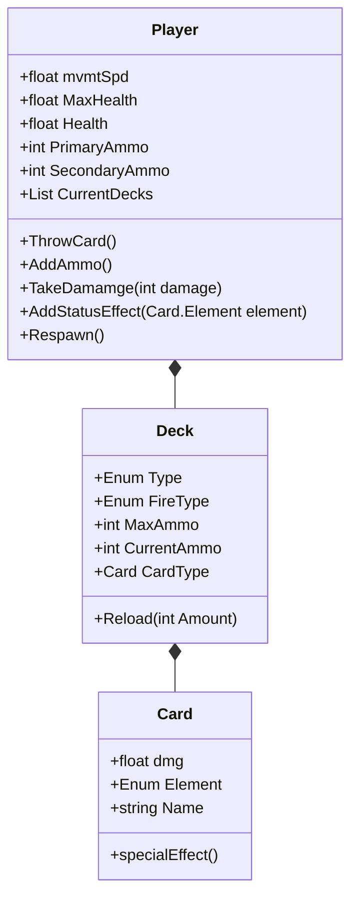
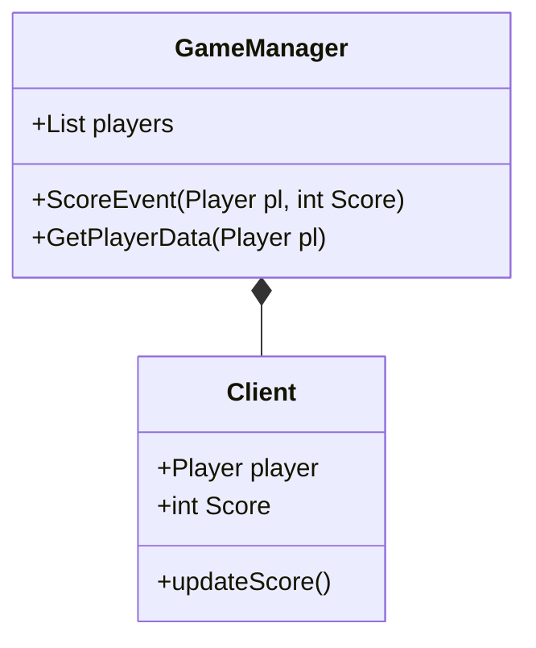

# Client UML

```mermaid
classDiagram

    class Player{
        +float mvmtSpd
        +float MaxHealth
        +float Health
        +int PrimaryAmmo
        +int SecondaryAmmo
        +List<Deck> CurrentDecks
        +ThrowCard()
        +AddAmmo()
        +TakeDamamge(int damage)
        +AddStatusEffect(Card.Element element)
        +Respawn()
    }
    Player *-- Deck
    class Deck {
        +Enum Type
        +Enum FireType
        +int MaxAmmo
        +int CurrentAmmo
        +Card CardType

        +Reload(int Amount)
    }
    Deck *-- Card
    class Card {
        +float dmg
        +Enum Element
        +string Name
        +specialEffect()
    }
    
```
# Server UML

```mermaid
classDiagram
    class GameManager{
        +List<Client> players

        +ScoreEvent(Player pl, int Score)
        +GetPlayerData(Player pl)
    }
    GameManager *-- Client
    class Client{
        +Player player
        +int Score
        +updateScore()
    }
```